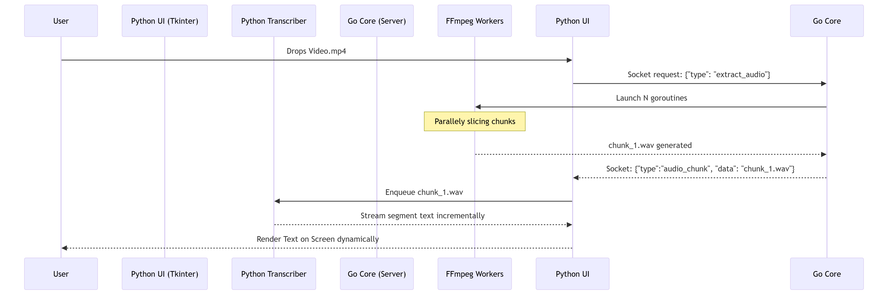

# Architecture Overview

Whisper Transcriber is built upon a hybrid architecture splitting the application into two completely independent executables: a **Python Graphical User Interface (GUI)** and a **Go Background Daemon (Core)**.

These two processes operate simultaneously and communicate back and forth exclusively through a local network socket using a strictly defined JSON Inter-Process Communication (IPC) protocol.

## Why a Hybrid Architecture?

A traditional monolithic Python application utilizing `customtkinter` and `faster-whisper` faces several severe bottlenecks when dealing with multi-gigabyte video files:

1.  **The FFmpeg Bottleneck**: Extracting audio perfectly from complex video containers (like `.mkv`) is incredibly CPU-intensive. Python’s native subprocess management is prone to locking the Global Interpreter Lock (GIL) and failing to utilize multi-core concurrency effectively.
2.  **The GUI Lockup**: Machine Learning inference requires enormous, blocking tensor calculations. Even when running on secondary Python threads, the Tkinter main event loop will often stutter or completely freeze ("Not Responding" state in Windows) during peak memory allocation.

By isolating the heavy lifting into a specialized Go process, whisper-transcriber inherently bypasses these limitations.

## The Go Daemon (`core/`)

Go (Golang) is statically typed, compiled to pure machine code, and utilizes native OS threads (goroutines) extraordinarily well.

- **Responsibility**: The Go application acts entirely as a silent background server. It manages hardware probing (checking for NVIDIA GPUs), downloads massive Hugging Face models using resilient chunking, and most importantly: runs a concurrent pool of `ffmpeg` workers to slice audio files into logical segments perfectly in parallel.
- **Execution**: It is compiled first. The exact executable (e.g., `wt-core.exe`) is physically shipped inside the final Python application bundle.

## The Python Frontend (`ui/app/`)

Python remains the absolute king of Machine Learning libraries (`PyTorch`, `faster-whisper`, `huggingface-hub`).

- **Responsibility**: It renders the CustomTkinter dark-mode graphical window, handles user drag-and-drop inputs, intercepts the audio segments generated sequentially by the Go server, and processes them through the GPU mathematically.
- **Execution**: `ui/app/main.py` is the actual master entry point for the user. When the Python file is launched, it automatically runs an `os.Popen()` command silently booting the Go Core executable before immediately wiring a TCP/Unix socket to it.

## Execution Flow Diagram

## Security & Port Collisions

To prevent malicious local applications from intercepting your audio or text, the internal socket server dynamically binds to port `0` (giving it a randomized loopback port by the OS) or creates a randomized `/tmp/*.sock` file on Unix. The Go server exclusively authenticates the literal Python parent process executing it, actively rejecting all external generic requests.
